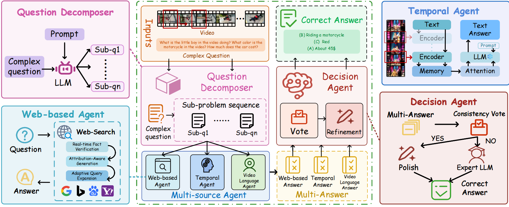

<h2 align="center">Multimodal Long Video Reasoning via Hierarchical Multi-Agent Retrieval-Augmented Generation</h2>

<p align="center">
  <a href="https://github.com/hanzif1/videoRAG" target="_blank"></a>
</p>
<p align="center">
  <strong>Jisheng Dang</strong><sup>1</sup>, <strong>Quan Wan</strong><sup>1</sup>, <strong>Dewei Liu</strong><sup>1</sup>, <strong>Ziyue Wang</strong><sup>1</sup>, <strong>Bimei Wang</strong>, <strong>Pei Liu</strong><sup>3</sup>, <strong>Hong Peng</strong><sup>1</sup>, <strong>Bin Hu</strong><sup>1</sup>, <strong>Tat-Seng Chua</strong><sup>4</sup>
  <p align="center"><sup>1</sup>Lanzhou University, <sup>2</sup>The Hong Kong University of Science and Technology, <sup>3</sup>The Hong Kong University of Science and Technology, <sup>4</sup>National University of Singapore</p>


> **TL;DR:** We propose a **Hierarchical Multi-Agent RAG** framework that decomposes complex video queries, retrieves external knowledge, and aggregates answers for robust video understanding.

---

**VideoRAG** addresses the limitations of current LLMs in video-text alignment and long-horizon reasoning. By coordinating specialized agents hierarchically, our framework effectively fuses internal temporal understanding with external knowledge retrieval.

<p align="center">
  
</p>


### 🤖 Core Agents
Our approach consists of three specialized agents working in synergy:
1.  **Question Decomposition Agent**: Reformulates complex/ambiguous queries into structured sub-tasks.
2.  **Multi-source Reasoning Agents**:
    * *Web Agent*: Retrieves external open-world knowledge.
    * *Memory-based Agent*: Captures long-range temporal dependencies within videos.
3.  **Answer Aggregation Agent**: Synthesizes results, resolves contradictions, and generates the final prediction.

## 🔥 News

- **`2025.12.3`** 🚧 Initial release of the multi-agent framework.

## 🏆 Performance on Benchmarks

We achieve state-of-the-art performance on challenging multimodal video reasoning tasks.
这个表格非常棒，数据很有说服力：用更小的参数量（2B）实现了全面的领先。

为了把它完美地融入 GitHub 的 README.md，我帮你把 LaTeX 代码转换成了 Markdown 格式。我去掉了 LaTeX 特有的引用符号（\cite），并保留了你的粗体强调，让读者一眼就能看到 Ours 的优势。

您可以直接复制下面的代码替换原来的 Performance on Benchmarks 部分：

Markdown

## 🏆 Performance on Benchmarks

We compare our method with state-of-the-art models across four challenging benchmarks. Despite having fewer parameters (**2B**), our framework achieves the best performance across all metrics.

| Method | Size | Acc@MME | Acc@QA | Acc@MVB | Acc@MLVU |
| :--- | :---: | :---: | :---: | :---: | :---: |
| FrozenBiLM | 1.2B | 32.5 | 48.6 | 31.0 | - |
| Video-ChatGPT | 7B | 38.5 | 55.2 | 33.8 | 39.4 |
| Otter | 9B | 45.3 | 59.1 | 40.5 | 41.2 |
| mPLUG-Owl | 7B | 48.6 | 56.5 | 51.4 | 46.2 |
| MovieChat | 7B | 46.5 | 58.2 | 46.8 | 48.1 |
| LLaMA-VID | 7B | 42.1 | 57.8 | 41.3 | 43.5 |
| TinyLLaVA | 3B | 44.2 | 58.1 | 45.5 | 44.8 |
| LLaVA-Phi | 2.7B | 42.5 | 56.4 | 43.1 | 41.2 |
| ST-LLM | 7B | 50.1 | 59.6 | 51.9 | 49.8 |
| VILA-2.7B | 2.7B | 48.9 | 60.5 | 49.2 | 51.0 |
| **Ours** | **2B** | **53.26** | **66.62** | **52.8** | **62.3** |

## Todo

1. **Release the code**

## 🛠️ Installation

1. **Clone the repository**
```bash
git clone [https://github.com/hanzif1/videoRAG.git](https://github.com/hanzif1/videoRAG.git)
cd videoRAG
```